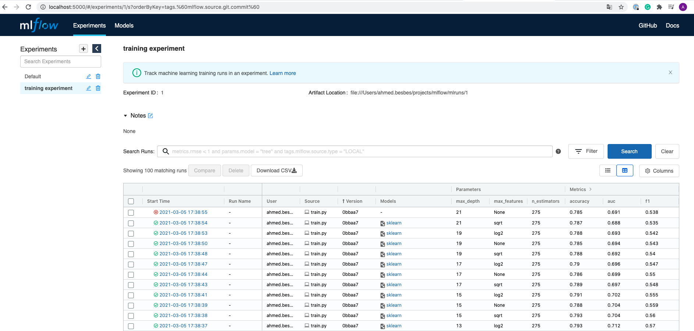

### How to use MLflow to simplify the Machine Learning lifecycle


In this repo, I experiment with MLflow to:

- track machine learning experiments based on:

  - metrics
  - hyper-parameters
  - source scripts executing the run
  - code version
  - notes & comments

- compare different runs between each other
- set up a tracking server locally and on AWS
- deploy the your best model using MLflow Models

### Quickstart

To execute the code:

- Install pipenv to run a virtual environment with mlflow (it's cleaner this way)

```bash
pip install pipenv
```

- Clone the project

```bash
git clone git@github.com:ahmedbesbes/mlflow.git
```

- Install the dependencies

```bash
cd mlflow/
pipenv install .
```

- Start a tracking server locally

```bash
mlflow ui
```

- Launch the training

```bash
python train.py
```

- Visit http://localhost:5000 to check the runs on MLflow ui



### Slides

- French version
- English version
